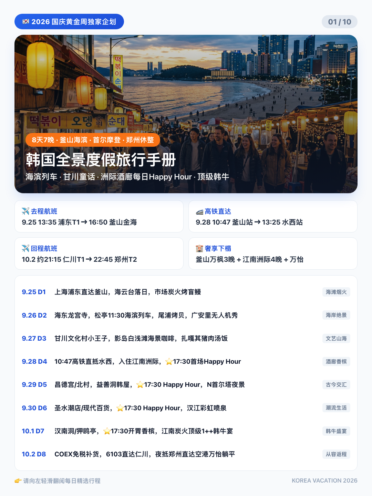
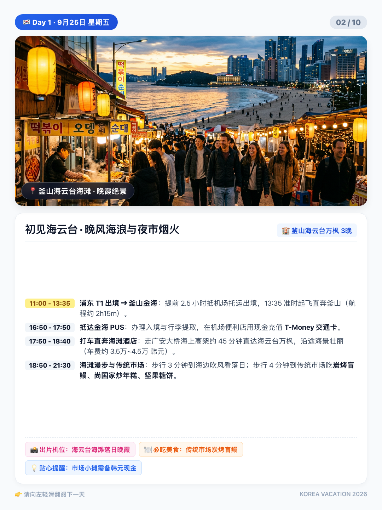
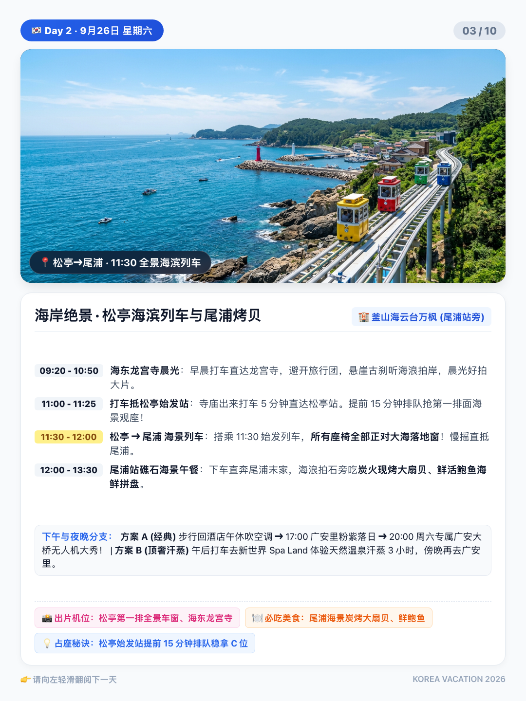
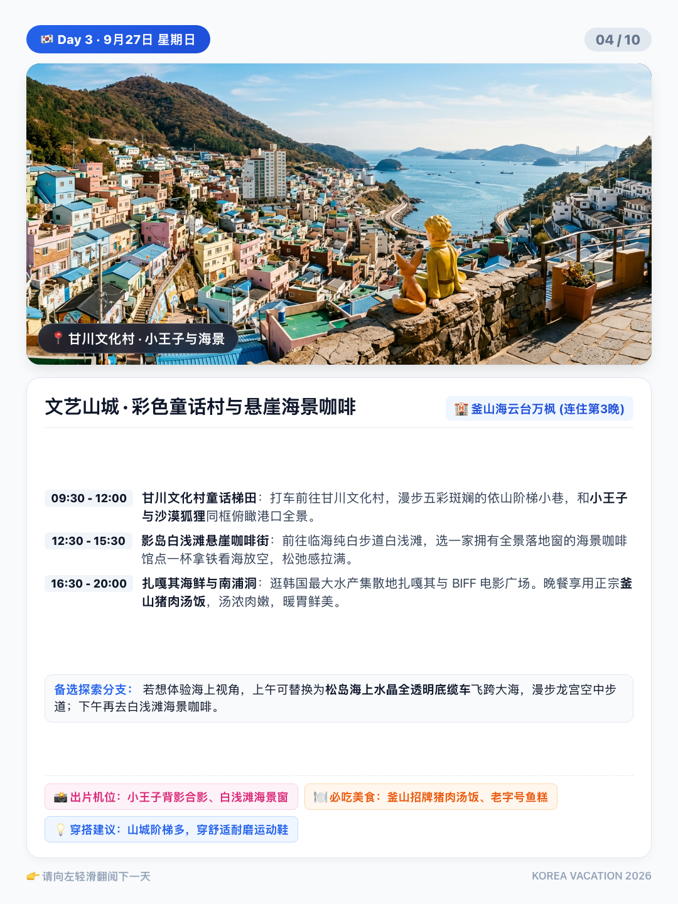
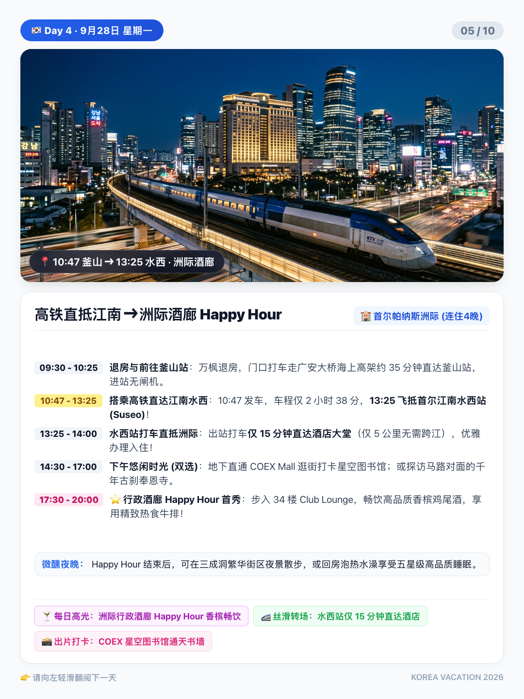
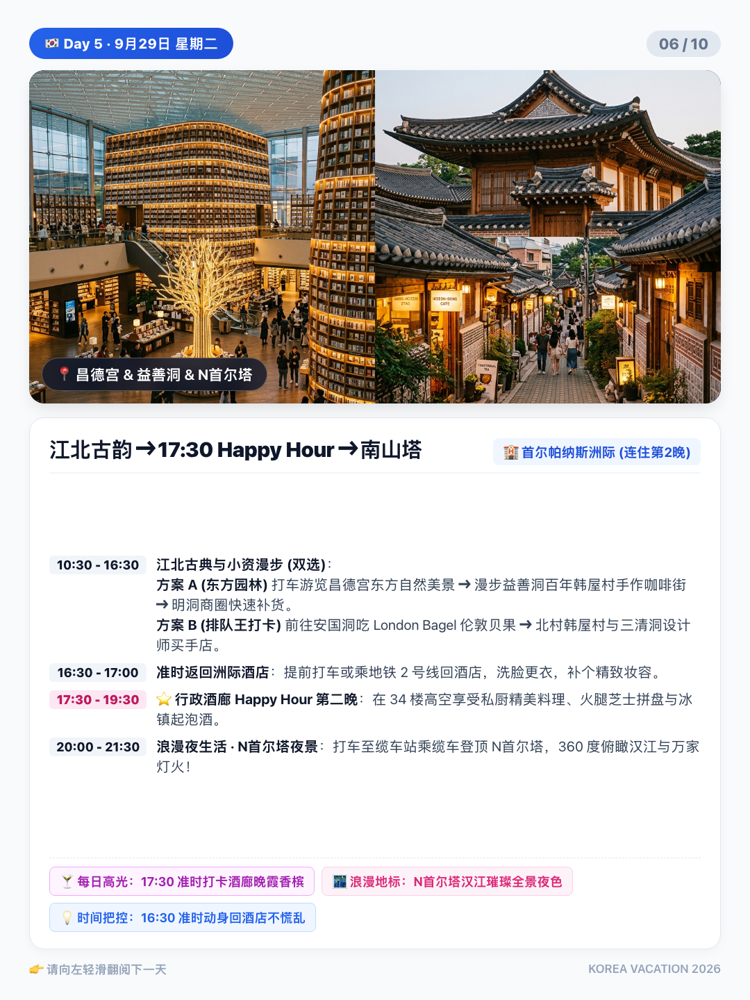
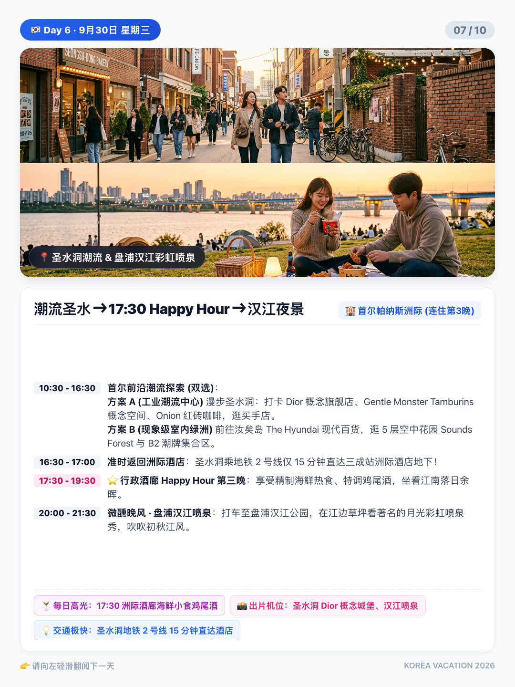
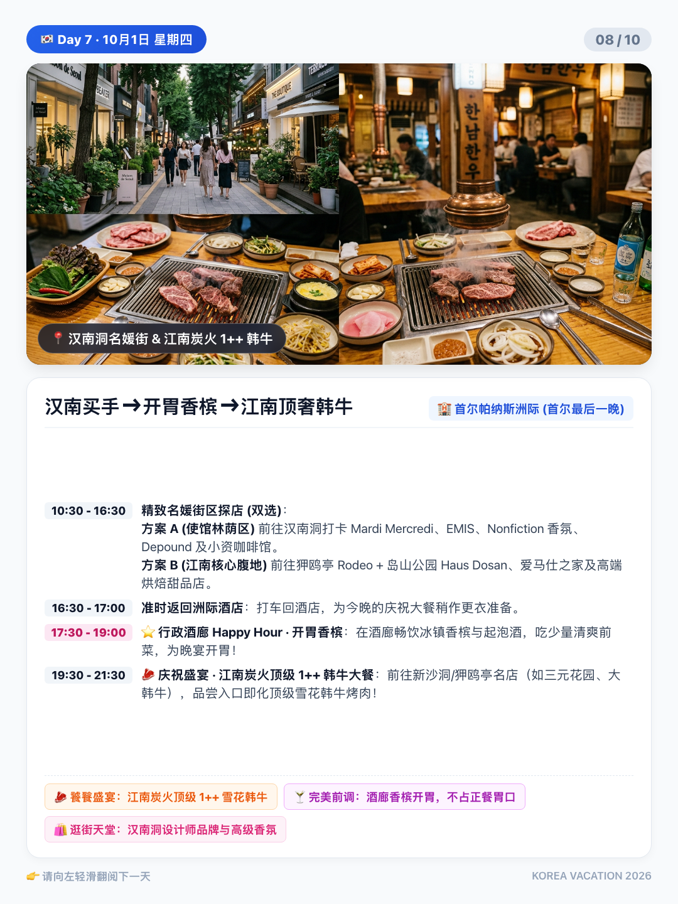
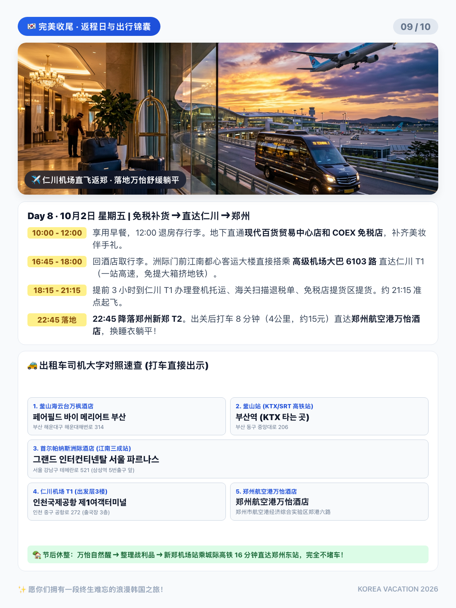
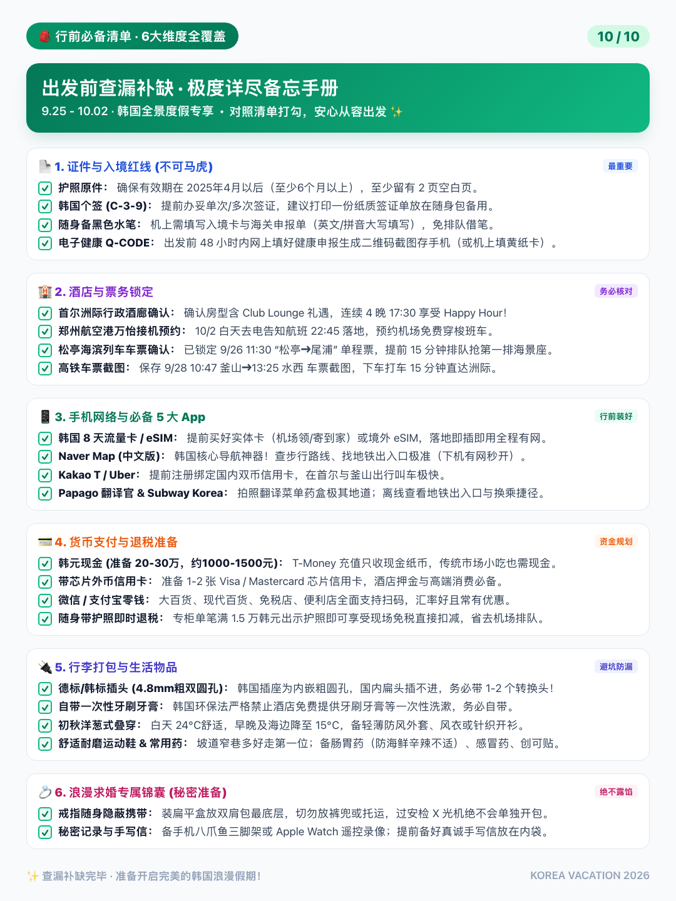

# 🇰🇷 韩国全景度假旅行指南 (Korea Travel Plan)
### 🌊 釜山海滨度假 · 🏙️ 首尔摩登潮流 · 🍸 洲际酒廊每日 Happy Hour · 🏡 郑州空港从容休整
> **出行日期：** 2026年9月25日 — 10月2日（国庆黄金周定制方案）  
> **行程亮点：** 海云台晚风海滩、松亭11:30全景海滨列车第一排、尾浦礁石炭烤大扇贝、广安里周六无人机秀、**首尔帕纳斯洲际连住4晚·每日17:30行政酒廊香槟Happy Hour**、多条城市探索 A/B 弹性分支、江南炭火顶级 1++ 韩牛盛宴、落地空港万怡舒缓躺平。

---

## ✈️ 核心大交通与转场时刻表 (精确到分钟)

| 航段 / 车次 | 日期与时间 | 出发地 ➔ 目的地 | 交通方式与关键说明 |
| :--- | :--- | :--- | :--- |
| **去程直飞航班** | **9月25日 (D1)** 13:35 ➔ 16:50 | **上海浦东 (PVG T1)** ➔ **釜山金海 (PUS 国际)** | ✈ 直飞航程约 2h15m；出关后打车 45 分钟走广安大桥海面高架直达海云台万枫酒店 |
| **城际高铁 (SRT)** | **9月28日 (D4)** 10:47 ➔ 13:25 | **釜山站 (Busan)** ➔ **首尔水西站 (Suseo)** | 🚄 高铁车程仅 2h38m；**水西站直达江南，离洲际仅 5 公里**，打车 15 分钟直达，早早入住，从容享受 17:30 行政酒廊 Happy Hour |
| **回程直飞航班** | **10月2日 (D8)** 约21:15 ➔ 22:45 | **首尔仁川 (ICN T1)** ➔ **郑州新郑 (CGO T2)** | ✈ 洲际门前乘 **高级机场大巴 6103 路** 一站高速直达仁川 T1；落地新郑打车 8 分钟（4公里）直达航空港万怡躺平 |

---

## 🏨 全程精选奢享酒店

1. **釜山海云台万枫酒店 (Fairfield by Marriott Busan)**  
   * **入住时间：** 9月25日 - 9月28日（连住 3 晚）  
   * **位置优势：** 坐落海云台核心，步行 3 分钟到沙滩，步行 4 分钟至传统海鲜市场，步行 10 分钟到海滨列车尾浦站。
2. **首尔帕纳斯洲际酒店 (Grand InterContinental Seoul Parnas)**  
   * **入住时间：** 9月28日 - 10月2日（连住 4 晚，享行政酒廊尊享礼遇）  
   * **奢华核心：** **每日 17:30 - 20:00 准时打卡 34 楼行政酒廊 Happy Hour**，高空俯瞰江南日落天际线，畅饮香槟、红白葡萄酒与特调鸡尾酒，享用精致冷热菜与牛排！地下直通 **Starfield COEX Mall**、**星空图书馆** 与 **地铁 2 号线三成站 / 9 号线奉恩寺站**。
3. **郑州航空港万怡酒店 (Courtyard by Marriott Zhengzhou Airport)**  
   * **入住时间：** 10月2日 - 10月3日/4日（落地休整 1-2 晚）  
   * **位置优势：** 离新郑机场 T2 仅 4 公里（车程 8 分钟），落地即刻洗漱安睡，避开深夜长途奔波。

---

## 📊 8天7晚 全程总览速查表 (含每日 Happy Hour 闭环)

| 日期 | 城市 / 路线 | 当日行程核心安排与探索选项 | 当晚下榻 | 核心大交通与时间节点 |
| :--- | :--- | :--- | :--- | :--- |
| **9.25 (D1)** | 上海浦东 ➔ 釜山 | 抵达釜山、海云台海滩晚霞、传统市场夜市（炭烤盲鳗/坚果糖饼） | **釜山海云台万枫** | ✈ **13:35 浦东 T1 ➔ 16:50 釜山金海 PUS** 🚕 机场打车直达酒店约 45 分钟 |
| **9.26 (D2)** | 釜山 | 海东龙宫寺晨光 ➔ **松亭 11:30 海滨列车第一排** ➔ 尾浦礁石海景烤扇贝 • *分支 A (经典)：* 回酒店午休吹空调 ➔ 广安里落日与**周六 20:00 无人机大秀** • *分支 B (汗蒸)：* 午后去新世界 Spa Land 顶奢温泉汗蒸 3 小时 ➔ 广安里 | **釜山海云台万枫** | 出租车 / 海景列车 / 步行 |
| **9.27 (D3)** | 釜山 | 甘川文化村小王子 ➔ 影岛白浅滩悬崖海景咖啡 ➔ 扎嘎其海鲜与猪肉汤饭 • *备选分支：* 上午可替换为松岛海上水晶全透明底缆车飞跨大海 | **釜山海云台万枫** | 出租车 / 地铁 1 号线 |
| **9.28 (D4)** | 釜山 ➔ 首尔 | **10:47 高铁直达水西 (13:25到)** ➔ 水西打车 15 分钟直达洲际办入住 ➔ 下午 COEX 星空图书馆通天书墙 ➔ **🍸 17:30 行政酒廊 Happy Hour 首秀** ➔ 三成洞夜景漫步 | **首尔帕纳斯洲际** | 🚄 **10:47 釜山站 ➔ 13:25 水西站 (SRT)** 🚕 水西打车 15 分钟直达洲际 |
| **9.29 (D5)** | 首尔 | • *分支 A (东方园林)：* 昌德宫东方美景 ➔ 益善洞百年韩屋小资咖啡街 ➔ 明洞 • *分支 B (网红排队)：* 安国洞吃 London Bagel 伦敦贝果 ➔ 北村韩屋村与三清洞买手店 ➔ **17:00 准时回洲际，🍸 17:30 Happy Hour 第二晚** ➔ 晚上南山缆车登 N首尔塔夜景 | **首尔帕纳斯洲际** | 地铁 2/3/4 号线 / 缆车 |
| **9.30 (D6)** | 首尔 | • *分支 A (工业潮流中心)：* 圣水洞打卡 Dior 概念店、Gentle Monster、买手店 • *分支 B (室内空中绿洲)：* 汝矣岛 The Hyundai 现代百货 5 层空中花园 Sounds Forest ➔ **17:00 准时回洲际，🍸 17:30 Happy Hour 第三晚** ➔ 晚上盘浦汉江公园月光彩虹喷泉秀 | **首尔帕纳斯洲际** | 地铁 2/5 号线 |
| **10.1 (D7)** | 首尔 | • *分支 A (使馆林荫区)：* 汉南洞逛 Mardi、EMIS、Nonfiction 香氛、小资咖啡 • *分支 B (江南核心区)：* 狎鸥亭 Rodeo + 岛山公园 Haus Dosan、爱马仕之家及烘焙名店 ➔ **17:00 准时回洲际，🍸 17:30 Happy Hour 开胃香槟** ➔ **19:30 江南炭火顶级 1++ 雪花韩牛晚宴** | **首尔帕纳斯洲际** | 地铁 6/2 号线 / 出租车 |
| **10.2 (D8)** | 首尔 ➔ 郑州 | 现代百货与 COEX 补齐免税伴手礼 ➔ **16:45 乘 6103 大巴直达仁川 T1** ➔ **21:15 起飞 ➔ 22:45 降落新郑 T2** ➔ 打车 8 分钟直达万怡换睡衣躺平 | **郑州航空港万怡** | 🚌 6103 豪华机场大巴直达 ✈ 21:15 仁川 ➔ 22:45 新郑 |
| **10.3-4** | 郑州空港 ➔ 市区 | 万怡睡到自然醒、享用自助早餐、拆箱整理战利品、吃烩面安抚中国胃、避峰从容返回市区 | **温馨的家** | 🚄 新郑机场站城际高铁 16 分钟直达郑州东站 |

---

## 📱 小红书风 3:4 手机翻页卡片 (全套 10 张预览)

本项目包含 10 张为手机端阅读定制的 **3:4 黄金比例超清卡片（1080 × 1440 像素）**，保存在 `cards/` 目录下，可在微信中左右轻滑翻阅：

| 卡片 01 · 封面总览 | 卡片 02 · Day 1 釜山 | 卡片 03 · Day 2 海滨列车 |
| :---: | :---: | :---: |
|  |  |  |

| 卡片 04 · Day 3 文艺山海 | 卡片 05 · Day 4 高铁进江南 | 卡片 06 · Day 5 古典韩屋 |
| :---: | :---: | :---: |
|  |  |  |

| 卡片 07 · Day 6 圣水汉江 | 卡片 08 · Day 7 汉南韩牛 | 卡片 09 · Day 8 归郑锦囊 |
| :---: | :---: | :---: |
|  |  |  |

  <b>卡片 10 · 行前必备清单 (6 大维度全覆盖 Check-List)</b> 
  

---

## 🎒 行前必备 6 大核心核对清单 (Check-List)

1. **📄 1. 证件与入境红线 (不可马虎)：**
   * [x] **护照原件：** 确保有效期在 2025年4月以后（至少6个月以上），至少留有 2 页空白页。
   * [x] **韩国个签 (C-3-9)：** 提前办妥单次/多次签证，建议打印一份纸质签证单放在随身包备用。
   * [x] **随身备黑色水笔：** 机上需填写入境卡与海关申报单（英文/拼音大写填写），免排队借笔。
   * [x] **电子健康 Q-CODE：** 出发前 48 小时内网上填好健康申报生成二维码截图存手机（或机上填黄纸卡）。
2. **🏨 2. 酒店与票务锁定：**
   * [x] **首尔洲际行政酒廊确认：** 确认房型含 Club Lounge 礼遇，连续 4 晚 17:30 准时享受 Happy Hour！
   * [x] **郑州航空港万怡接机预约：** 10/2 白天去电告知航班 22:45 落地，预约机场免费穿梭班车。
   * [x] **松亭海滨列车车票确认：** 已锁定 9/26 11:30 “松亭➔尾浦” 单程票，提前 15 分钟排队抢第一排海景座。
   * [x] **高铁车票截图：** 保存 9/28 10:47 釜山➔13:25 水西 车票截图，下车打车 15 分钟直达洲际。
3. **📱 3. 手机网络与必备 5 大 App：**
   * [x] **韩国 8 天流量卡 / eSIM：** 提前买好实体卡（机场领/寄到家）或境外 eSIM，落地即插即用全程有网。
   * [x] **Naver Map (中文版)：** 韩国核心导航神器！查步行路线、找地铁出入口极准（下机有网秒开）。
   * [x] **Kakao T / Uber：** 提前注册绑定国内双币信用卡，在首尔与釜山出行叫车极快。
   * [x] **Papago 翻译官 & Subway Korea：** 拍照翻译菜单药盒极其地道；离线查看地铁出入口与换乘捷径。
4. **💳 4. 货币支付与即时退税：**
   * [x] **韩元现金 (准备 20-30万，约1000-1500元)：** T-Money 充值只收现金纸币，传统市场小吃也需现金。
   * [x] **带芯片外币信用卡：** 准备 1-2 张 Visa / Mastercard 芯片信用卡，酒店押金与高端消费必备。
   * [x] **微信 / 支付宝零钱：** 大百货、现代百货、免税店、便利店全面支持扫码，汇率好且常有优惠。
   * [x] **随身带护照即时退税：** 专柜单笔满 1.5 万韩元出示护照即可享受现场免税直接扣减，省去机场排队。
5. **🔌 5. 行李穿搭与生活物品：**
   * [x] **德标/韩标插头 (4.8mm粗双圆孔)：** 韩国插座为内嵌粗圆孔，国内扁头插不进，务必带 1-2 个转换头！
   * [x] **自带一次性牙刷牙膏：** 韩国环保法严格禁止酒店免费提供牙刷牙膏等一次性洗漱，务必自带。
   * [x] **初秋洋葱式叠穿：** 白天 24℃舒适，早晚及海边降至 15℃，备轻薄防风外套、风衣或针织开衫。
   * [x] **舒适耐磨运动鞋 & 常用药：** 坡道窄巷多好走第一位；备肠胃药（防海鲜辛辣不适）、感冒药、创可贴。
6. **💍 6. 浪漫/求婚专项锦囊 (秘密准备)：**
   * [x] **戒指随身隐蔽携带：** 装扁平盒放双肩包最底层，切勿放裤兜或托运，过安检 X 光机绝不会单独开包。
   * [x] **秘密记录与手写信：** 备手机八爪鱼三脚架或 Apple Watch 遥控录像；提前备好真诚手写信放在内袋。

---

## 🚕 出租车司机大字对照速查卡 (手机直接出示)

* **1. 釜山海云台万枫酒店**  
  `페어필드 바이 메리어트 부산`  
  *주소: 부산 해운대구 해운대해변로 314*
* **2. 釜山站 (KTX/SRT 高铁站)**  
  `부산역 (KTX 타는 곳)`  
  *주소: 부산 동구 중앙대로 206*
* **3. 首尔帕纳斯洲际酒店 (江南三成站)**  
  `그랜드 인터컨티넨탈 서울 파르나스`  
  *주소: 서울 강남구 테헤란로 521 (삼성역 5번출구 앞)*
* **4. 仁川国际机场 T1 (出发层3楼)**  
  `인천국제공항 제1여객터미널`  
  *위치: 인천 중구 공항로 272 (출국장 3층)*
* **5. 郑州航空港万怡酒店**  
  `郑州航空港万怡酒店`  
  *地址：郑州市航空港经济综合实验区郑港六路*

---

## 🌐 网页版离线浏览指南（全部 100% 纯内联，零外部依赖）

仓库内包含三个可以直接在任何浏览器打开的完整独立 HTML 文件，**所有图片均已 Base64 内联打包**，无需网络、离线秒开、单文件即可随心分享：
* 🖼️ **`cards_gallery_inline.html`**：**【3:4 翻页相册 · 极力推荐】** 专为手机翻阅打造的小红书风卡片相册！10 张高清大字卡片全部内嵌，支持手机**左右滑动手势翻页**、键盘方向键切换及底部缩略图跳转，像刷手机相册一样惬意流畅。
* 📱 **`index.html`**：**【手机大字长页指南】** 专为手机单手竖屏滑动浏览优化，正文字体放大至 18px+，全部 8 天图文及打车大字卡均内嵌其中，可直接添加到 iPhone 主屏幕像独立 App 一样随时查看。
* 💻 **`korea_travel_guide.html`**：**【电脑大屏 / A4 打印版】** 专为大屏阅读与打印导出 PDF 定制的排版网页，内嵌全部高分辨率实景原图，支持在浏览器中直接快捷键 Command + P 存为高清 PDF。

---
*Wish you a wonderful & romantic journey in Korea! ✨*
